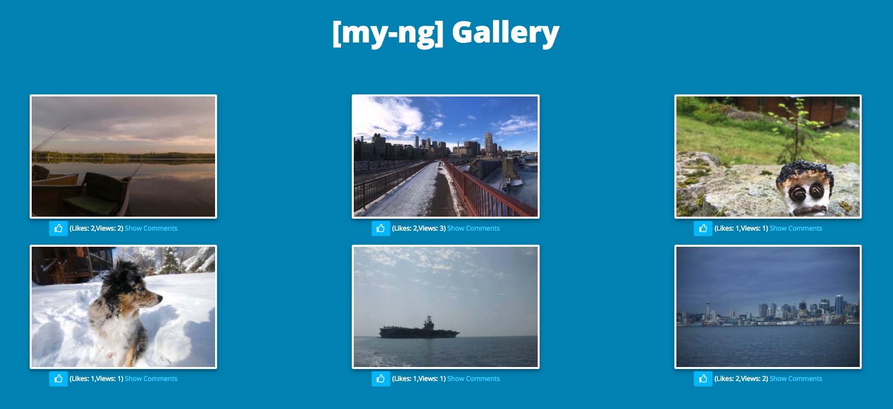

# [my-ng] Gallery

An image gallery application built using AngularJS. Allows users to view, like, and comment on images.

Application can be tested [here](https://damp-sierra-70974.herokuapp.com/)

## Built With

 - HTML/CSS
 - AngularJS
 - JavaScript
 - Node.js
 - Express.js
 - PostgreSQL

### Next Steps

- [ ] New image upload.
